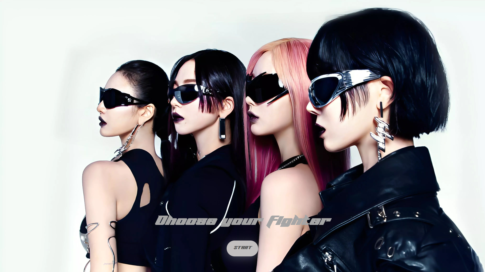
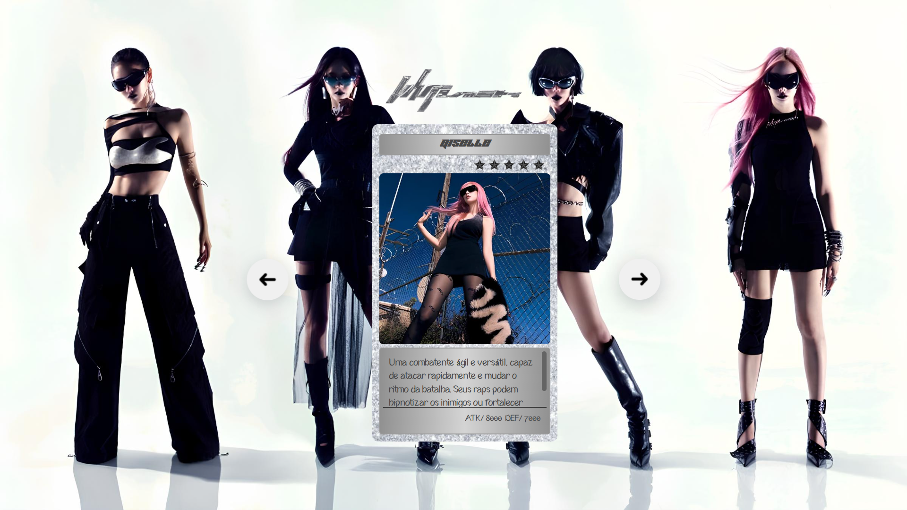

#  ๋࣭ ⭑ Projeto Whiplash - æ𝚜𝚙𝚊  ๋࣭ ⭑

## 
## 

> Projeto adaptado da Semana do Zero ao Programador Contratado, do [Dev em Dobro](https://github.com/devemdobro)

[Clique aqui para acessar]()

## ᯓ★ æ𝚜𝚙𝚊

aespa é um grupo feminino de K-pop que mistura realidade e universo virtual, criando um conceito futurista único

## 💻 Tecnologias 

- HTML
- CSS 
- JavaScript